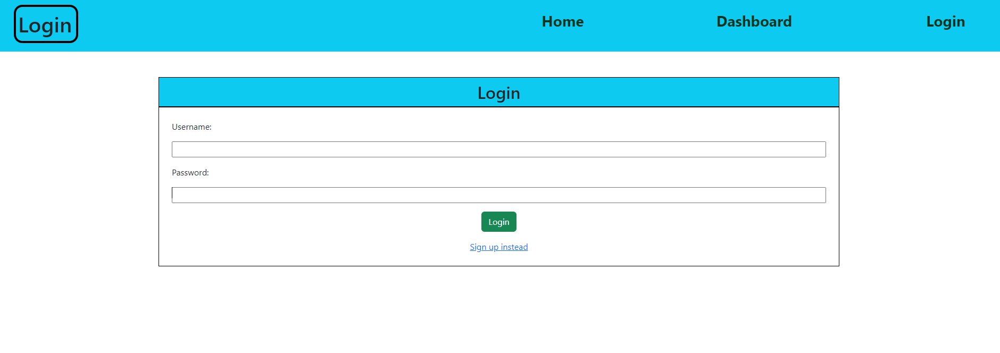
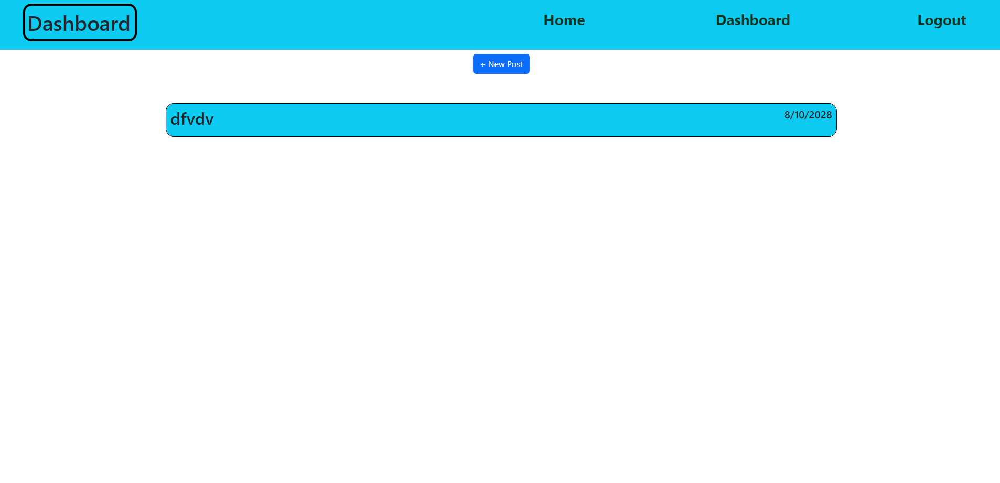

# Tech Blog
   

## Description

## Table of Contents
1. [Installation](#installation)
2. [Usage](#usage)
3. [License](#license)
4. [Questions](#questions)

## Installation
Visit the deployed application: https://kajiantechblog-7580c41800b3.herokuapp.com/

If you want to run it locally clone this repository. Then sign into mysql through the terminal and run 'source db/schema.sql', to create the database. Next run 'npm install'. Lastly, run 'npm start' to get the application running on your localhost browser.

## Usage
1.Post tech blogs
2.On click can see the post and comments on that post
3.You can add comments
4.Create accounts

## License
This project is licensed under mit 
https://opensource.org/licenses/MIT

## Questions
If you have any additional questions regarding this project please contact me at kajianpulenthirasingam@gmail.com.
You can view more of my work at https://github.com/kajianpulenthirasingams